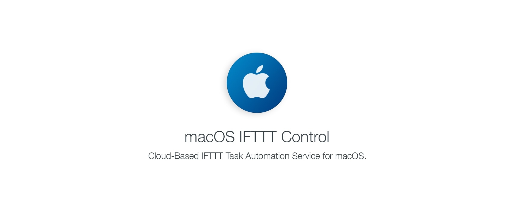

#  macOS IFTTT Control

**macOS IFTTT Control** – macOS IFTTT Control is a free, open source service for
macOS that allows users to perform tasks and automate processes on their Macs
in conjunction with different services using IFTTT.

With macOS IFTTT Control you don't need to worry about installing web servers
on your Mac or having to configure port forwarding on your router or get a
dedicated IP address, since macOS IFTTT Control uses the power of DropBox to work,
which makes macOS IFTTT Control capable of working on any Mac with an internet
connection.

## Features
### IFTTT Applets
We provide some pre-made applets on our website but you can make your own applets
using almost everything services available in IFTTT, giving you the possibility
to automate your Mac.

### Webhooks Events
You want to trigger an applet? macOS IFTTT Control support Webhooks events, when an
event it's invoked using macOS IFTTT Control, the registered Webhook for that event
will be triggered.

### Voice Control with your Favourite Assistant
The reason why I created this project. Now you can control your Mac using Google
Assistant, Amazon Alexa or even Cortana. Sleep your Mac, Change the volume and much
more using only your voice.

## Use Pre-Made Applets and Make your own Applets
You can start using macOS IFTTT Control today using our pre-made applets or you can
create your own applets by checking our documentation [here](https://github.com/abdyfranco/macos-ifttt-control/wiki).

##### Donate any amount:
 - [PayPal](https://www.paypal.me/abdyfranco)
 - [Bitcoin](https://www.blockchain.com/btc/payment_request?address=1LMLf1JDouaeEwpUxsH6PpFptYM4LB7b9B) 

## Copyright
- Copyright (c) 2017-2019 [Abdy Franco](http://abdyfran.co/)
